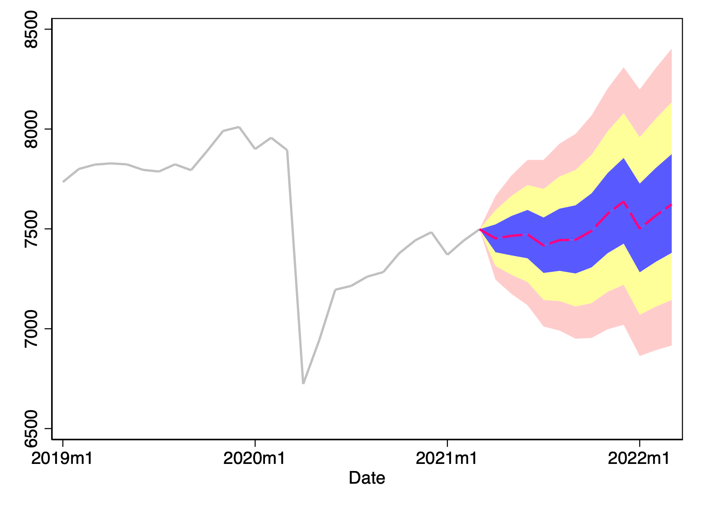

# Part 1

## Time Series Plots

## No Logs

​	You do not want to take logs because that adjusts the distance between values and normalizes the data. Without the distances between data being preserved, there is no good way to measure proportions unless the log transformed data has identical transforms performed (the data going in would have to be the same).

## Persistent Data

### Construct

​	Both first lags are high which means we should difference.

| Test                                   | Result |
| -------------------------------------- | ------ |
| MacKinnon approximate p-value for Z(t) | 0.9796 |

### Manufacture

​	Both first lags are high which means we should difference.

| Test                                   | Result |
| -------------------------------------- | ------ |
| MacKinnon approximate p-value for Z(t) | 0.9963 |

### Total

​	Both first lags are high which means we should difference.

| Test                                   | Result |
| -------------------------------------- | ------ |
| MacKinnon approximate p-value for Z(t) | 0.6570 |

​	Even though the dickey fuller test says we do not need to difference for construct, manufacture, and total, I'm still going to because ~~I already wrote everything with it differenced~~ the lags outside the confidence intervals in the PAC quite far apart and I can't imagine that there is really that much of an impact on current employment by employment from 30+ months ago. The only ones I can maybe understand are the 12 and 24 moth lags because employers will use historical data when hiring seasonal employees.

### Leisure

​	Both first lags are high which means we should difference.

| Test                                   | Result |
| -------------------------------------- | ------ |
| MacKinnon approximate p-value for Z(t) | 0.0005 |

​	The p value for leisure is below .05 so I don't need an excuse to difference this time. However, it must be noted that lags 31 and 32 are extremely high.

## Serial Correlation

​	Because not all lags are within the 95% confidence interval, we should worry at least a little bit about serial correlation. However, as I suggested earlier, the only lags that could have a true impact are the 12th and 24th lags and so I am not worried about serial correlation.

## Dropping Lags

|             |            |           |       |       |            |           |
| ----------- | ---------- | --------- | ----- | ----- | ---------- | --------- |
|             | Newey-West |           |       |       |            |           |
| D.lnTotal   | Coef.      | Std. Err. | t     | P>t   | [95% Conf. | Interval] |
|             |            |           |       |       |            |           |
| Construct   |            |           |       |       |            |           |
| D1.         | .0004252   | .0000809  | 5.26  | 0.000 | .0002661   | .0005842  |
| LD.         | .0000247   | .000044   | 0.56  | 0.574 | -.0000617  | .0001112  |
| L2D.        | .0000613   | .0000403  | 1.52  | 0.129 | -.0000179  | .0001405  |
| L3D.        | -.0000674  | .0000577  | -1.17 | 0.244 | -.000181   | .0000462  |
| L12D.       | -.000035   | .0000641  | -0.55 | 0.585 | -.000161   | .000091   |
| L24D.       | .0000494   | .0000684  | 0.72  | 0.470 | -.0000851  | .0001839  |
| Manufacture |            |           |       |       |            |           |
| D1.         | .0011938   | .0001924  | 6.21  | 0.000 | .0008154   | .0015723  |
| LD.         | -.0002374  | .0001386  | -1.71 | 0.088 | -.00051    | .0000353  |
| L2D.        | -.000336   | .0000718  | -4.68 | 0.000 | -.0004773  | -.0001948 |
| L3D.        | -.0002689  | .0001059  | -2.54 | 0.012 | -.0004772  | -.0000606 |
| L12D.       | .0003308   | .0001381  | 2.39  | 0.017 | .000059    | .0006025  |
| L24D.       | .0002403   | .0001413  | 1.70  | 0.090 | -.0000376  | .0005182  |
| Leisure     |            |           |       |       |            |           |
| D1.         | .0002134   | 8.38e-06  | 25.47 | 0.000 | .0001969   | .0002299  |
| LD.         | 5.34e-06   | 9.19e-06  | 0.58  | 0.561 | -.0000127  | .0000234  |
| L2D.        | -2.42e-06  | .0000172  | -0.14 | 0.888 | -.0000364  | .0000315  |
| L3D.        | -8.76e-06  | .0000174  | -0.50 | 0.614 | -.0000429  | .0000254  |
| L12D.       | .0000629   | .0000361  | 1.74  | 0.082 | -8.04e-06  | .0001339  |
| L24D.       | -.000016   | .0000428  | -0.37 | 0.708 | -.0001002  | .0000681  |
|             |            |           |       |       |            |           |
| _cons       | .0011957   | .0003664  | 3.26  | 0.001 | .000475    | .0019165  |

​	The Newey-West test suggests we should drop lags 12 and 24.

| Test Number | Variable | | Test Value |
| ----- | ---------------- | ---- | ---- |
| (1)   | L24D.Construct  | =    | 0     |
| (2)   | L12D.Leisure  | =     | 0     |
| (3)   | L24D.Leisure | =     | 0     |
| (4)   | L12D.Manufacture | =    | 0    |
| (5)   | L24D.Manufacture | =    | 0    |

​	`testparm` suggests that there is no interaction between the 12th and 24th lags of each construct, leisure, and manufacture.

## Equal Effects

| Interaction             | Prob > F |
| ----------------------- | -------- |
| Construct ~ Manufacture | 0.0161   |
| Construct ~ Leisure     | 0.0008   |
| Manufacture ~ Leisure   | 0.0301   |

​	The p-value for all three is less than 0.05 which means we can reject the null hypothesis and accept the alternative that the impacts of each variable are not equal.

# Part 2

## Differencing, Log Transforms, and Month Dummies

### Differencing

​	See above AC and PAC charts in [Part 1](#Persistent-Data).

### Log Transforms

​	Log transforms make the data not have any values less than zero and forces the data into a normal distribution. It also transforms the data so it has proportional changes rather than absolute changes so that any changes over time can be reported as a percent change.

### Month Dummies

​	There's not any reason to not include month dummies. If your data is monthly or any other form of seasonal, it will help your models because they're now identified to a particular season. If your data isn't seasonal, they won't have any effect.

## Content Knowledge and Model Searches

### Content Knowledge

​	Content knowledge can speed up the model selection process because you may already have an idea of what variables or lags have an effect on the dependent variable. For example, hourly wages and hours scheduled per week are probably a very good indication of monthly wages.

### GSREG

​	Global search regression takes all the variables you feed it and runs a regression for any combination of the variables. This is a powerful tool to fine-tune your models, but without filtering the variables through content knowledge, it could take a very long time to run. Rather than just taking the highest scoring model, you should then examine common features of the highest scoring models on the basis of AIC, BIC, and out of sample root mean square error, and choose the most parsimonious one.

### What's wrong with *stepwise* model selection?

​	It's prone to over fitting because it has bad predictive properties. Instead you should use out of sample fitting because it protects against over fitting. Over fitting is caused by dropping the most insignifcant each step which may include variables that should be included in the model but are not relevant on their own.

## Choosing Models

| Model Type                                     | Model                                                        | AIC       | BIC       | Root Mean Squared Errors |
| ---------------------------------------------- | ------------------------------------------------------------ | --------- | --------- | ------------------------ |
| AR only Lags 1-3 Month dummies       | ` reg d.lnTotal l(1/3)d.lnTotal m1 m2 m3 m4 m5 m6 m7 m8 m9 m10 m11` | -2382.725 | -2323.982 | .0129605                 |
| AR only Lags 1-3,12,24 Month dummies | `reg d.lnTotal l(1/3,12,24)d.lnTotal m1 m2 m3 m4 m5 m6 m7 m8 m9 m10 m11` | -2236.218 | -2170.633 | .01300797                |
| ARDL Lags 1-3 Month dummies          | `reg d.lnTotal l(1/3)d.lnTotal l(1/3)d.lnConstruct l(1/3)d.lnLeisure l(1/3)d.lnManufacture m1 m2 m3 m4 m5 m6 m7 m8 m9 m10 m11` | -2393.008 | -2299.019 | .01611154                |
| ARDL Lags 1-3,12,24 Month dummies    | ` reg d.lnTotal l(1/3,12,24)d.lnTotal l(1/3,12,24)d.lnConstruct l(1/3,12,24)d.lnLeisure l(1/3)d.lnManufacture m1 m2 m3 m4 m5 m6 m7 m8 m9 m10 m11` | -2230.781 | -2115.043 | .01713897                |

### Which are the best two and why?

​	Model 1 has the lowest root mean squared error and model 3 has the lowest AIC and BIC. I'm also inclined to believe these are the better ones because they don't include lags 12 and 24 which is a long time for subcomponents of the total employment variable to have an effect on the total employment variable.

### Rolling Window

#### Model 1

` reg d.lnTotal l(1/3)d.lnTotal m1 m2 m3 m4 m5 m6 m7 m8 m9 m10 m11`

| Value Type | Value    |
| ---------- | -------- |
| RWmaxobs12 | 12       |
| RWminobs12 | 12       |
| RWrmse12   | .0132376 |

A window width of 12 had the lowest RWrmse. I thought that maybe a smaller window width would be better because the lags did not include lag 12 but I was wrong. Besides 12 months, 6 months had the second lowest.

#### Model 3

`reg d.lnTotal l(1/3)d.lnTotal l(1/3)d.lnConstruct l(1/3)d.lnLeisure l(1/3)d.lnManufacture m1 m2 m3 m4 m5 m6 m7 m8 m9 m10 m11`

| Value Type | Value    |
| ---------- | -------- |
| RWmaxobs12 | 12       |
| RWminobs12 | 12       |
| RWrmse12   | .0132376 |

A window width of 12 had the lowest RWrmse. After my failure in model 1, I tried again hoping for better results. A window width of 12 is still the best.

Ultimately, I'm going to choose model 1 because it is autoregressive and that is what makes ARIMA work and without ARIMA I could not make my pretty fan charts. They have the same RWrmse anyways so I can't imagine the extra variables have too big a difference. And 

## Forecasting

### One month ahead

> Sorry for the bad colors. Hailey peer pressured me into it.

### One year out

> Ditto my earlier comment on the colors :)

### Forecast Evaluation

#### Empirical

#### Normal

#### Chebyshev

