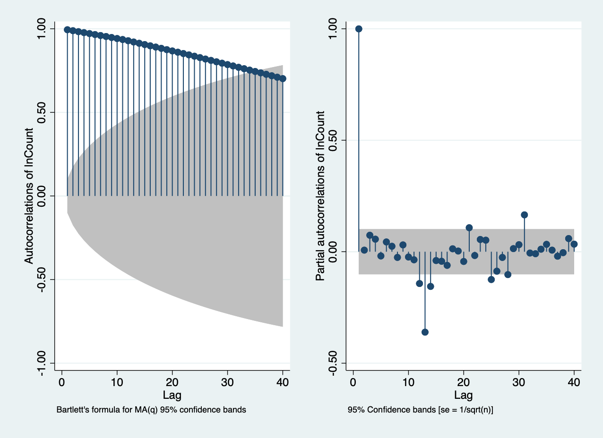
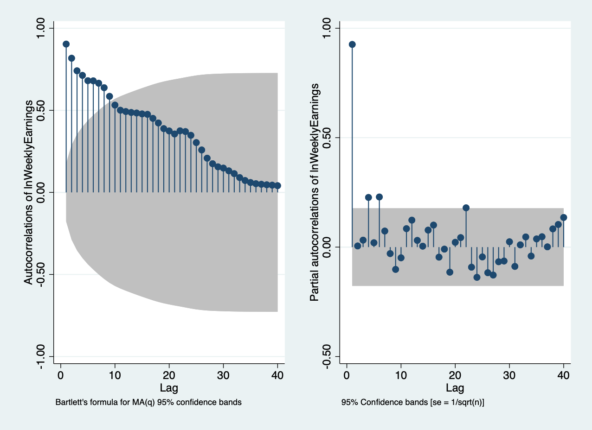

# Final Project Deliverable 1

## Summary statistics

| Variable     | Obs  | Mean     | Std. Dev. | Min    | Max   |
| ------------ | ---- | -------- | --------- | ------ | ----- |
|              |      |          |           |        |       |
| Count        | 374  | 14.18556 | 6.880684  | 5.3    | 28    |
| WeekHours    | 122  | 36.86967 | 3.804193  | 28.3   | 45.8  |
| HourlyEarn~s | 122  | 19.70344 | 2.910126  | 15.01  | 24.6  |
| WeeklyEarn~s | 122  | 719.7972 | 84.82529  | 503.79 | 916.1 |
| ServiceCount | 374  | 10.40455 | 5.940013  | 3.9    | 22.8  |

| Variable     | Obs  | Mean     | Std. Dev. | Min      | Max      |
| ------------ | ---- | -------- | --------- | -------- | -------- |
|              |      |          |           |          |          |
| lnCount      | 374  | 2.5174   | .5398403  | 1.667707 | 3.332205 |
| lnWeekHours  | 122  | 3.602049 | .1041722  | 3.342862 | 3.824284 |
| lnHourlyEa~s | 122  | 2.969891 | .148565   | 2.708717 | 3.202746 |
| lnWeeklyEa~s | 122  | 6.57194  | .1198394  | 6.222159 | 6.820126 |
| lnServiceC~t | 374  | 2.16967  | .5975865  | 1.360977 | 3.12676  |

## AC and PAC

> We should difference the data

