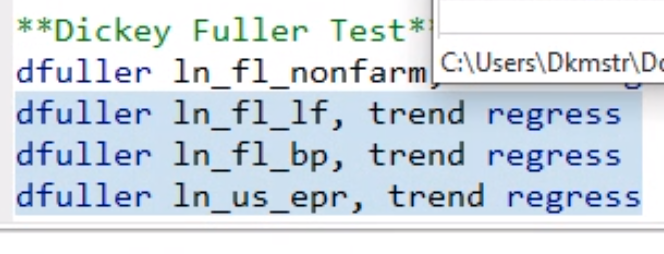

## Part A

> 1. Writethemodel $y_t =α+ δt+ ρy_{t-1} + βx_{t-1} + r$ in first differences.

- 

> 2. Suppose after first differencing a model is $∆y_t = δ-φ−2φt+ρ∆y_{t-1}+β∆x_{t-1}+∆r_t$. What was it before the first difference was taken? (Hint: both $t$ and $t^2$ are in it.)

- 

> 3. Suppose you are originally interested in the model $y_t=\alpha+\delta t+\rho y_{t-1}+\beta x_{t-1}+r_t$, where $r_t=\gamma r_{t-1} + \varepsilon_t$ and $\varepsilon_t$ is an independent random disturbance. Write the dynamically complete model in first differences. Hint: first substitute to make the model dynamically complete, and then take the first difference.

## Part B

3. Evaluate Autocorrelation and Weak Dependence
   1. Obtain the correlation of each variable with its one period lag.
   2. Obtain the autocorrelogram and partial autocorrelagram for each variable.
   3. Conduct the Dickey-Fuller unit root rest for each variable.
   4. Interpret these results.

graph combine var1 var2

if fuller high, can't reject

