**Problem Set 2**

**Gus Lipkin**

**CAP 4763 Time Series Modelling and Forecasting**


# Table of Contents


|                           Section                            |
| :----------------------------------------------------------: |
|                    [**Part A**](#Part-A)                     |
|                    [**Part B**](#Part-B)                     |
| [3 Autocorrelation and Weak Dependence](#3.-Autocorrelation-and-Weak-Dependence) |
| [4 ARDL Model and Breusch-Godfrey Test](#4.-ARDL-Model-and-Breusch-Godfrey-Test) |
| [5 Dynamically Complete Models and Newey-West Standard Errors ](#5.-Dynamically-Complete-Models-and-Newey-West-Standard-Errors ) |
|                [**Appendix A**](#Appendix-A)                 |
|                [**Appendix B**](#Appendix-B)                 |


> I joke but I really shouldn't. I'm spending so much time worrying about how to do things in STATA and trying to understand how it works and make it do what I want that I have no clue what's going on in this class. I have become so frustrated with STATA to the point of crying at least once for each Problem Set and several times in between.
> I have no doubt that no matter how hard I try, I will fail the midterm.

<div style="page-break-after: always; break-after: page;"></div>

## Part A

1. Writethemodel $y_t =α+ δt+ ρy_{t-1} + βx_{t-1} + r$ in first differences.

- $\Delta y_t=\delta+\rho\Delta y_{t-1}+\beta\Delta x_{t-1}+\Delta r_t$

2. Suppose after first differencing a model is $∆y_t = δ-φ−2φt+ρ∆y_{t-1}+β∆x_{t-1}+∆r_t$. What was it before the first difference was taken? (Hint: both $t$ and $t^2$ are in it.)

- $y_t=\delta t+\varphi t^2+\varphi t-\varphi +\rho y_{t-1}+\beta x_{t-1}+r_t$

3. Suppose you are originally interested in the model $y_t=\alpha+\delta t+\rho y_{t-1}+\beta x_{t-1}+r_t$, where $r_t=\gamma r_{t-1} + \varepsilon_t$ and $\varepsilon_t$ is an independent random disturbance. Write the dynamically complete model in first differences. Hint: first substitute to make the model dynamically complete, and then take the first difference.

- $y_t=\alpha+\delta t+\rho y_{t-1}+\beta x_{t-1} + \gamma r_{t-1} + \varepsilon_t$
- $\Delta y_t=\delta+\rho\Delta y_{t-1}+\beta\Delta x_{t-1}+\gamma\Delta r_{t-1} + \Delta\varepsilon_t$


## Part B

### 3. Autocorrelation and Weak Dependence
   1. Obtain the correlation of each variable with its one period lag.

| (obs=875) | corr ln_us_epr l1.ln_us_epr |
|--|----------------------------- |
| | L.                            |
| | ln_us_~r ln_us_~r             |
| ln_us_epr |                    |
| -. |   1.0000                  |
| L1.   | 0.9758   1.0000        |

| (obs=983)  | corr ln_fl_nonfarm l1.ln_fl_nonfarm |
|--|----------------------------------- |
| | L.                                    |
| | ln_fl_~m ln_fl_~m                     |
| ln_fl_nonf~m |                         |
| -. |   1.0000                          |
| L1. |   0.9999   1.0000                |

| (obs=539)  | corr ln_fl_lf l1.ln_fl_lf |
| --|------------------------- |
||  L.                         |
| | ln_fl_lf ln_fl_lf           |
| ln_fl_lf  |                  |
| -.   | 1.0000                |
| L1.   |  0.9997   1.0000      |

| (obs=395)   | corr ln_fl_bp l1.ln_fl_bp |
| --| ----------------------- |
||  L.                        |
|| ln_fl_bp ln_fl_bp         |
| ln_fl_bp   |               |
| -.   | 1.0000              |
| L1.  |  0.9470   1.0000    |

- There appears to be very high correlation between the log form of each variable and its first lag. The highest is ln_fl_nonfarm with a correlation of .9999, followed by ln_fl_lf, ln_us_epr, and ln_fl_bp with .9997, .9758, and .9470 respectively.

2. Obtain the autocorrelogram and partial autocorrelagram for each variable.

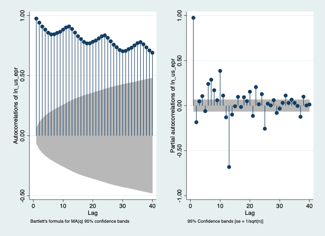

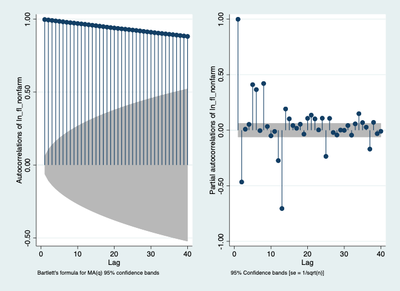

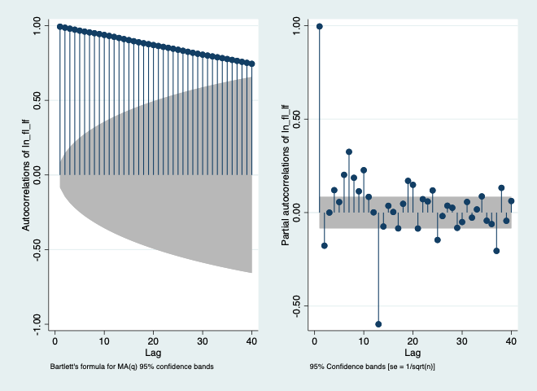

​	For the above three graphs, because all of the points are outside and above the cone, we can conclude that there is an autoregressive term in the data and should consult the partial autocorrelation graph. The PAC suggests that this is a higher order moving average.

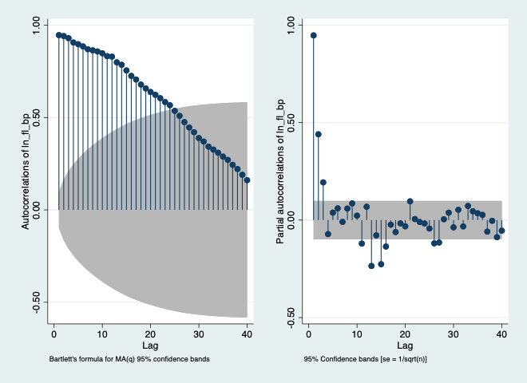

​	For the last graph, the autocorrelation is not all outside of the confidence interval. When we look at the PAC we see that there are significant correlations in the first few terms followed by insignificant correlations in the rest. This suggests the order of the autoregressive term.

3. Conduct the Dickey-Fuller unit root rest for each variable.

> I promise I really wanted to do nice tables here but for the life of me couldn't get stata to let me copy them properly or export them and I really didn't want to transcribe them

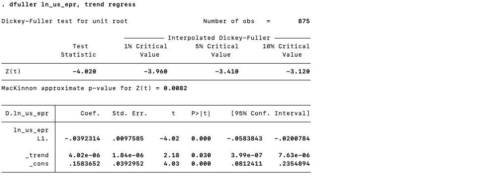

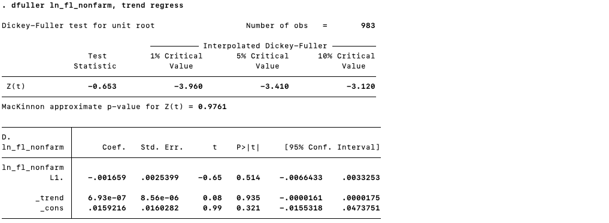

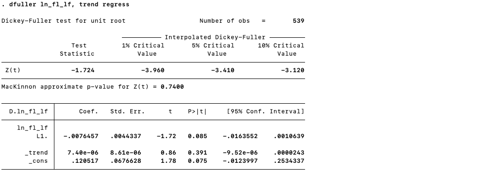

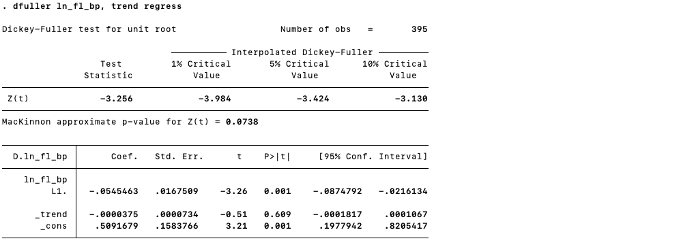

​	For both Dickey-Fuller of the ln_us_epr, the p-value is extremely low at .0082 and so we accept the null hypothesis. For all others, we fail to reject the null hypothesis. Especially ln_fl_nonfarm and ln_fl_lf.

### 4. ARDL Model and Breusch-Godfrey Test

Given the results of the previous question, transform the data as needed and estimate a dynamically complete ARDL model for non-farm employment. Include at least one lag of the relevant dependent variable. How many additional lags of the dependent variable, and how many lags of which independent variables you include, are up to you. Looking back at what you did for Problem Set 1 might be informative, but don’t be limited by it. Produce and interpret the AC and PAC for the residuals and the results of a Breusch-Godfrey test. In your write up, justify your specification and interpret the results.

> I really wanted to try doing every other lag rather than every lag as Jake suggested but I couldn't find a way to generate a sequence of every other number in a set range. I tried doing 
>
> ```
> gen seq3 = 2*mod(_n-1,48)
> ```
>
> but couldn't check if it was right because the data viewer isn't showing anything then when I tried to use it I got an error that it wasn't a valid list of numbers.

| .                                           | regress d.ln_fl_nonfarm l(1/48)d.ln_fl_nonfarm | l(12/24)d.ln_us_epr | l(1/18, 24)d.ln_fl_lf | date |
| ------------------------------------------- | ---------------------------------------------- | ------------------- | --------------------- | ---- |
|                                             | Source        SS           df       MS         | Number of obs   =   | 515                   |      |
|                                             | F(81, 433)      =                              | 15.48               |                       |      |
| Model   .050091055        81  .000618408    | Prob > F        =                              | 0.0000              |                       |      |
| Residual    .01729335       433  .000039938 | R-squared       =                              | 0.7434              |                       |      |
|                                             | Adj R-squared   =                              | 0.6954              |                       |      |
| Total   .067384405       514  .000131098    | Root MSE        =                              | .00632              |                       |      |
| ------------- | --------- | --------- | ----- | ----- | ---------- | --------- |
| D.            |           |           |       |       |            |           |
| ln_fl_nonfarm | Coef.     | Std. Err. | t     | P>t   | [95% Conf. | Interval] |
|               |           |           |       |       |            |           |
| ln_fl_nonfarm |           |           |       |       |            |           |
| LD.           | -.1441103 | .059346   | -2.43 | 0.016 | -.2607523  | -.0274683 |
| L2D.          | -.1332106 | .060728   | -2.19 | 0.029 | -.2525689  | -.0138524 |
| L3D.          | .0520745  | .060831   | 0.86  | 0.392 | -.0674863  | .1716354  |
| L4D.          | .1139409  | .0609067  | 1.87  | 0.062 | -.0057687  | .2336504  |
| L5D.          | .066288   | .0611891  | 1.08  | 0.279 | -.0539766  | .1865526  |
| L6D.          | .1944856  | .0614959  | 3.16  | 0.002 | .073618    | .3153532  |
| L7D.          | .0759452  | .0622902  | 1.22  | 0.223 | -.0464836  | .1983741  |
| L8D.          | .0829208  | .0631492  | 1.31  | 0.190 | -.0411963  | .207038   |
| L9D.          | .2532911  | .0930772  | 2.72  | 0.007 | .0703519   | .4362303  |
| L10D.         | .1403499  | .0960901  | 1.46  | 0.145 | -.0485112  | .329211   |
| L11D.         | .1893271  | .0946093  | 2.00  | 0.046 | .0033766   | .3752776  |
| L12D.         | .4685154  | .0957577  | 4.89  | 0.000 | .2803077   | .6567232  |
| L13D.         | .0758492  | .1003991  | 0.76  | 0.450 | -.1214811  | .2731795  |
| L14D.         | .0089228  | .1008964  | 0.09  | 0.930 | -.1893847  | .2072303  |
| L15D.         | .0490602  | .1006788  | 0.49  | 0.626 | -.1488197  | .24694    |
| L16D.         | -.0187785 | .1013922  | -0.19 | 0.853 | -.2180605  | .1805035  |
| L17D.         | .0547956  | .1017669  | 0.54  | 0.591 | -.1452228  | .2548141  |
| L18D.         | .0863921  | .1011552  | 0.85  | 0.394 | -.1124241  | .2852084  |
| L19D.         | -.25835   | .1016689  | -2.54 | 0.011 | -.4581759  | -.0585241 |
| L20D.         | -.1621826 | .1009034  | -1.61 | 0.109 | -.360504   | .0361389  |
| L21D.         | -.0839614 | .1033319  | -0.81 | 0.417 | -.2870559  | .1191331  |
| L22D.         | -.1719582 | .1017154  | -1.69 | 0.092 | -.3718755  | .0279592  |
| L23D.         | .0347504  | .1011416  | 0.34  | 0.731 | -.1640391  | .2335399  |
| L24D.         | .2927769  | .0998811  | 2.93  | 0.004 | .0964647   | .489089   |
| L25D.         | .1178616  | .098203   | 1.20  | 0.231 | -.0751523  | .3108754  |
| L26D.         | .0999885  | .0980021  | 1.02  | 0.308 | -.0926304  | .2926074  |
| L27D.         | -.1283723 | .0980801  | -1.31 | 0.191 | -.3211445  | .0644     |
| L28D.         | -.2031139 | .0980964  | -2.07 | 0.039 | -.3959182  | -.0103096 |
| L29D.         | -.2892074 | .097907   | -2.95 | 0.003 | -.4816395  | -.0967753 |
| L30D.         | -.5772115 | .0991658  | -5.82 | 0.000 | -.7721176  | -.3823054 |
| L31D.         | .6236058  | .1020615  | 6.11  | 0.000 | .4230083   | .8242034  |
| L32D.         | .1870999  | .1073141  | 1.74  | 0.082 | -.0238215  | .3980212  |
| L33D.         | .1426809  | .1091241  | 1.31  | 0.192 | -.0717978  | .3571596  |
| L34D.         | .1068341  | .1078243  | 0.99  | 0.322 | -.1050899  | .3187581  |
| L35D.         | -.0794067 | .1078368  | -0.74 | 0.462 | -.2913554  | .1325421  |
| L36D.         | .1327386  | .1064489  | 1.25  | 0.213 | -.0764823  | .3419594  |
| L37D.         | -.0639028 | .099194   | -0.64 | 0.520 | -.2588645  | .1310589  |
| L38D.         | -.048562  | .0984536  | -0.49 | 0.622 | -.2420684  | .1449445  |
| L39D.         | .0871388  | .0975069  | 0.89  | 0.372 | -.104507   | .2787845  |
| L40D.         | -.1442082 | .0974565  | -1.48 | 0.140 | -.3357548  | .0473384  |
| L41D.         | -.0032331 | .0966638  | -0.03 | 0.973 | -.1932218  | .1867555  |
| L42D.         | .0938246  | .0970599  | 0.97  | 0.334 | -.0969425  | .2845917  |
| L43D.         | -.3559573 | .0966539  | -3.68 | 0.000 | -.5459264  | -.1659882 |
| L44D.         | -.0089124 | .0978207  | -0.09 | 0.927 | -.2011749  | .1833501  |
| L45D.         | -.0882528 | .0966085  | -0.91 | 0.361 | -.2781327  | .1016272  |
| L46D.         | .1086727  | .091884   | 1.18  | 0.238 | -.0719214  | .2892668  |
| L47D.         | .0313382  | .091654   | 0.34  | 0.733 | -.1488038  | .2114803  |
| L48D.         | .0609195  | .091323   | 0.67  | 0.505 | -.118572   | .240411   |
|               |           |           |       |       |            |           |
| ln_us_epr     |           |           |       |       |            |           |
| L12D.         | -.0155085 | .1744885  | -0.09 | 0.929 | -.3584584  | .3274413  |
| L13D.         | -.3056076 | .153451   | -1.99 | 0.047 | -.607209   | -.0040062 |
| L14D.         | -.5608006 | .1545155  | -3.63 | 0.000 | -.8644942  | -.257107  |
| L15D.         | -.3645519 | .1519838  | -2.40 | 0.017 | -.6632696  | -.0658341 |
| L16D.         | .0029936  | .1580302  | 0.02  | 0.985 | -.3076081  | .3135954  |
| L17D.         | .0422232  | .1559561  | 0.27  | 0.787 | -.264302   | .3487483  |
| L18D.         | .3199335  | .1565006  | 2.04  | 0.042 | .0123381   | .6275288  |
| L19D.         | -.07463   | .0988972  | -0.75 | 0.451 | -.2690083  | .1197484  |
| L20D.         | .0625226  | .0999685  | 0.63  | 0.532 | -.1339614  | .2590065  |
| L21D.         | -.0436852 | .1002131  | -0.44 | 0.663 | -.2406498  | .1532795  |
| L22D.         | .2231831  | .0985078  | 2.27  | 0.024 | .0295703   | .416796   |
| L23D.         | -.0081188 | .0960409  | -0.08 | 0.933 | -.1968832  | .1806456  |
| L24D.         | -.2688582 | .1616447  | -1.66 | 0.097 | -.5865639  | .0488476  |
|               |           |           |       |       |            |           |
| ln_fl_lf      |           |           |       |       |            |           |
| LD.           | .1762398  | .0704433  | 2.50  | 0.013 | .0377865   | .3146932  |
| L2D.          | -.1356975 | .0715783  | -1.90 | 0.059 | -.2763815  | .0049866  |
| L3D.          | -.1659446 | .0715828  | -2.32 | 0.021 | -.3066375  | -.0252517 |
| L4D.          | -.0977864 | .0709175  | -1.38 | 0.169 | -.2371718  | .041599   |
| L5D.          | -.1364495 | .0722069  | -1.89 | 0.059 | -.278369   | .00547    |
| L6D.          | -.2270642 | .0723796  | -3.14 | 0.002 | -.3693234  | -.0848051 |
| L7D.          | -.1332104 | .0724525  | -1.84 | 0.067 | -.2756127  | .0091919  |
| L8D.          | -.2396185 | .0727056  | -3.30 | 0.001 | -.3825182  | -.0967187 |
| L9D.          | -.1256755 | .079465   | -1.58 | 0.114 | -.2818605  | .0305095  |
| L10D.         | -.180737  | .0797732  | -2.27 | 0.024 | -.3375278  | -.0239463 |
| L11D.         | -.005726  | .0808095  | -0.07 | 0.944 | -.1645537  | .1531017  |
| L12D.         | .0558537  | .1334055  | 0.42  | 0.676 | -.2063492  | .3180565  |
| L13D.         | .0173463  | .1262683  | 0.14  | 0.891 | -.2308286  | .2655213  |
| L14D.         | .2969825  | .1275491  | 2.33  | 0.020 | .0462901   | .547675   |
| L15D.         | .125207   | .1266497  | 0.99  | 0.323 | -.1237177  | .3741316  |
| L16D.         | -.0665773 | .1288379  | -0.52 | 0.606 | -.3198027  | .186648   |
| L17D.         | -.1292395 | .1273895  | -1.01 | 0.311 | -.3796182  | .1211391  |
| L18D.         | -.2883037 | .1278108  | -2.26 | 0.025 | -.5395104  | -.037097  |
| L24D.         | .2278015  | .1255369  | 1.81  | 0.070 | -.018936   | .4745389  |
|               |           |           |       |       |            |           |
| date          | -8.65e-06 | 3.19e-06  | -2.72 | 0.007 | -.0000149  | -2.39e-06 |
| _cons         | .0058495  | .0022338  | 2.62  | 0.009 | .0014592   | .0102399  |
|               |           |           |       |       |            |           |

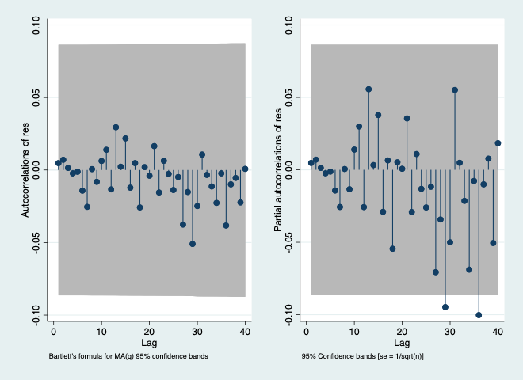

​	I don't think there's any correlation because almost everything is inside the interval.

| . estat bgodfrey, lag(1/48) |                 |
| --------------------------- | --------------- |
| Breusch-Godfrey LM test for | autocorrelation |

|                           |        |      |             |
| ------------------------- | ------ | ---- | ----------- |
| lags(p)                   | chi2   | df   | Prob > chi2 |
|                           |        |      |             |
| 1                         | 0.617  | 1    | 0.4321      |
| 2                         | 1.630  | 2    | 0.4427      |
| 3                         | 1.639  | 3    | 0.6506      |
| 4                         | 1.665  | 4    | 0.7970      |
| 5                         | 1.730  | 5    | 0.8850      |
| 6                         | 2.757  | 6    | 0.8387      |
| 7                         | 8.252  | 7    | 0.3109      |
| 8                         | 8.536  | 8    | 0.3830      |
| 9                         | 8.707  | 9    | 0.4648      |
| 10                        | 8.803  | 10   | 0.5509      |
| 11                        | 9.015  | 11   | 0.6205      |
| 12                        | 10.913 | 12   | 0.5364      |
| 13                        | 12.697 | 13   | 0.4715      |
| 14                        | 12.775 | 14   | 0.5443      |
| 15                        | 14.075 | 15   | 0.5198      |
| 16                        | 15.212 | 16   | 0.5091      |
| 17                        | 15.284 | 17   | 0.5751      |
| 18                        | 18.315 | 18   | 0.4351      |
| 19                        | 18.317 | 19   | 0.5014      |
| 20                        | 19.893 | 20   | 0.4647      |
| 21                        | 19.920 | 21   | 0.5263      |
| 22                        | 20.203 | 22   | 0.5704      |
| 23                        | 20.218 | 23   | 0.6287      |
| 24                        | 20.362 | 24   | 0.6760      |
| 25                        | 21.112 | 25   | 0.6864      |
| 26                        | 21.381 | 26   | 0.7221      |
| 27                        | 23.290 | 27   | 0.6693      |
| 28                        | 24.359 | 28   | 0.6624      |
| 29                        | 25.322 | 29   | 0.6615      |
| 30                        | 27.716 | 30   | 0.5855      |
| 31                        | 28.706 | 31   | 0.5846      |
| 32                        | 28.728 | 32   | 0.6330      |
| 33                        | 29.272 | 33   | 0.6533      |
| 34                        | 30.894 | 34   | 0.6207      |
| 35                        | 30.897 | 35   | 0.6666      |
| 36                        | 33.834 | 36   | 0.5720      |
| 37                        | 35.071 | 37   | 0.5597      |
| 38                        | 35.519 | 38   | 0.5847      |
| 39                        | 38.229 | 39   | 0.5049      |
| 40                        | 38.448 | 40   | 0.5402      |
| 41                        | 38.548 | 41   | 0.5801      |
| 42                        | 39.001 | 42   | 0.6034      |
| 43                        | 39.107 | 43   | 0.6408      |
| 44                        | 39.122 | 44   | 0.6804      |
| 45                        | 39.431 | 45   | 0.7061      |
| 46                        | 39.812 | 46   | 0.7278      |
| 47                        | 40.011 | 47   | 0.7550      |
| 48                        | 40.617 | 48   | 0.7664      |
| H0: no serial correlation |        |      |             |

> I'm so confused. It is at this point that I'm giving up trying to interpret stuff. I've spent nearly all day on it and am just as lost as before. I understand the basic commands such as regress and gen and all that. I know how to use the other commands. I don't understand what the functions are doing or why the results mean what they are said to mean. I feel like I'm being asked to draw an owl and these are my only instructions:
>
>   
>
> I know you've said time and time again that I don't need to know what stata's doing in the background but I don't understand the math and I can't see what stata's doing for the math. In lecture all I see is a bunch of letters set up for an equation that doesn't mean anything to me outside of super abstract concepts.
> Hailey and Jake and Mohammad will do their best to help me through everything. I'm reasonably certain that I can pass with about a 2 or so if my grade calculator is correct and my estimates are too. I'm not sure if it's worth it to stay in and just accept the hit to my GPA or not. Anyways. I'm going to turn this in now. I hope you're not too disappointed.

### 5. Dynamically Complete Models and Newey-West Standard Errors

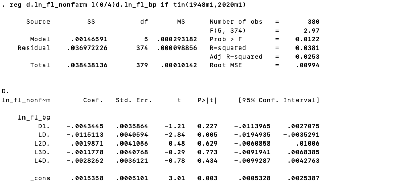

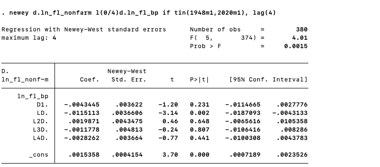

if fuller high, can't reject

## Appendix A

```stata
clear
set more off

cd "/Users/guslipkin/Documents/Spring2020/CAP 4763 ~ Time Series/Problem Sets/Problem Set 2"

*2a
*Done

*2b Load the data
import delimited "Assignment_1_Monthly.txt"

rename lnu02300000 us_epr
rename flnan fl_nonfarm
rename fllfn fl_lf
rename flbppriv fl_bp
rename date datestring

*2c Turn on a log file
log using "Problem Set 1", replace

*2d Generate a monthly date variable (make its display format monthly time, %tm)
gen datec=date(datestring, "YMD")
gen date=mofd(datec)
format date %tm

*2e tsset your data
tsset date

*2f
gen ln_us_epr=log(us_epr)
gen ln_fl_nonfarm=log(fl_nonfarm)
gen ln_fl_lf=log(fl_lf)
gen ln_fl_bp=log(fl_bp)

*3a
corr ln_us_epr l1.ln_us_epr
corr ln_fl_nonfarm l1.ln_fl_nonfarm
corr ln_fl_lf l1.ln_fl_lf
corr ln_fl_bp l1.ln_fl_bp

*3b
ac ln_us_epr, saving(ac_ln_us_epr.gph, replace)
pac ln_us_epr, saving(pac_ln_us_epr.gph, replace)
graph combine ac_ln_us_epr.gph pac_ln_us_epr.gph, saving(combo_ln_us_epr.gph, replace)

ac ln_fl_nonfarm, saving(ac_ln_fl_nonfarm.gph, replace)
pac ln_fl_nonfarm, saving(pac_ln_fl_nonfarm.gph, replace)
graph combine ac_ln_fl_nonfarm.gph pac_ln_fl_nonfarm.gph, saving(combo_ln_fl_nonfarm.gph, replace)

ac ln_fl_lf, saving(ac_ln_fl_lf.gph, replace)
pac ln_fl_lf, saving(pac_ln_fl_lf.gph, replace)
graph combine ac_ln_fl_lf.gph pac_ln_fl_lf.gph, saving(combo_ln_fl_lf.gph, replace)

ac ln_fl_bp, saving(ac_ln_fl_bp.gph, replace)
pac ln_fl_bp, saving(pac_ln_fl_bp.gph, replace)
graph combine ac_ln_fl_bp.gph pac_ln_fl_bp.gph, saving(combo_ln_fl_bp.gph, replace)

*3c
dfuller ln_us_epr, trend regress
dfuller ln_fl_nonfarm, trend regress
dfuller ln_fl_lf, trend regress
dfuller ln_fl_bp, trend regress

*4
regress d.ln_fl_nonfarm l(1/48)d.ln_fl_nonfarm l(12/24)d.ln_us_epr l(1/18, 24)d.ln_fl_lf date
predict res, residual
ac res, saving(p4_ac.gph, replace)
pac res, saving(p4_pac.gph, replace)
graph combine p4_ac.gph p4_pac.gph, saving(p4_combo.gph, replace)
estat bgodfrey, lag(1/48)

*5
reg d.ln_fl_nonfarm l(0/4)d.ln_fl_bp if tin(1948m1,2020m1)
newey d.ln_fl_nonfarm l(0/4)d.ln_fl_bp if tin(1948m1,2020m1), lag(4)

log close
```

## Appendix B

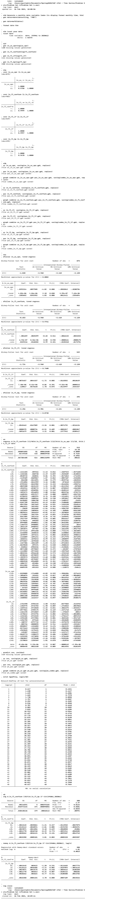