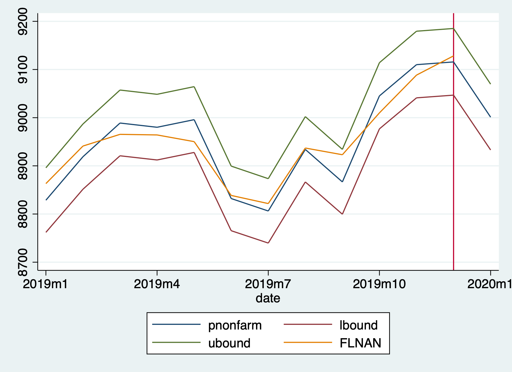
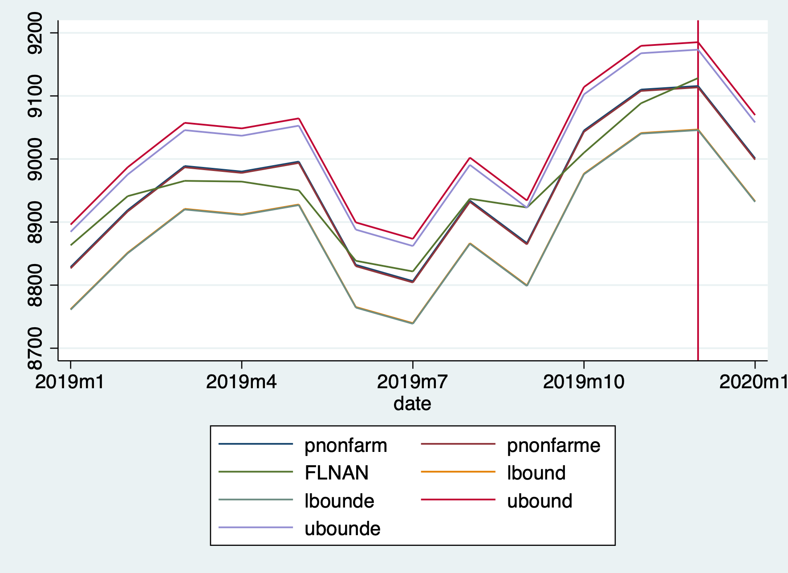

**Problem Set 5**

**Gus Lipkin**

**CAP 4763 Time Series Modelling and Forecasting**


# Table of Contents

|                           Section                            |
| :----------------------------------------------------------: |
|            [**Introduction**](#Introduction)             |
| [**GSREG, Rolling Window, and Choosing Models**](#GSREG,-Rolling Window,-and-Choosing-Models) |
|                          [GSREG](#GSREG)                           |
|                          [Rolling Window](#Rolling-Window)                           |
|            [**Using the Best Model to Forecast January 2020**](#Using-the-Best-Model-to-Forecast-January-2020)             |
|            [**Illustrations and Interpretations of the Models**](#Illustrations-and-Interpretations-of-the-Models)             |
|            [**Conclusion**](#Conclusion)             |
|                [**Appendix A**](#Appendix-A)                 |
|                [**Appendix B**](#Appendix-B)                 |

<div style="page-break-after: always; break-after: page;"></div>

# Introduction

​	Time Series Modelling and Forecasting allows us to be better prepared for the future by using past data to predict future trends. In this case, we are trying to predict total nonfarm employment for the state of Florida for January 2020.

​	First, we create log transforms of all the variables. Because the variables cannot be negative, conducting a log transform ensures that they will not become negative later on. Next, we can generate monthly indicators so that if data trends are tied to a specific month or are affected seasonally, the indicator values will show the correlations. The last step before conducting the time series modelling and forecasting is to determine the dataset's stationarity in time. To do this, we construct an autocorrelogram and partial-autocorrelogram.


​	The high partial autocorrelation of the first lag indicates that we should use the first difference of the data. This corrects for stationarity.

# GSREG, Rolling Window, and Choosing Models

## GSREG

​	Because GSREG runs through every possible combination of variables fed to it up to a maximum number of variables per regression, it is necessary to limit the number of variables. How these variables are chosen is up to the person running the analysis. When I ran mine, I decided to include the first, third, sixth, ninth, twelfth, and twenty-fourth lags of each differenced variable for `lnflnonfarm`, `lnfllf`,  and `lnusepr`. I also fixed the monthly indicators for January, March, June, and September. I chose to include all variables because while one variable may not have as heavy an influence, it is important to consider everything and conduct an analysis before dismissing any variables. I chose the lags and monthly indicators I did because while the data is monthly, I wanted to reduce the amount of variations that GSREG needs to go through without removing too many data points and without keeping too many variables that would cause the command to take too long to run. As for the twenty-fourth lag, I thought that there was a chance that long-term change would provide a grounding-point for the model so that it does not diverge too much. I understand that this can cause issues in times of immediate and rapid change such as the onset of COVID-19 but such events are few and far between. 

​	The resulting best model suggested by GSREG is `reg d.lnflnonfarm l3d.lnflnonfarm l6d.lnflnonfarm l12d.lnflnonfarm l24d.lnflnonfarm l24d.lnfllf l6d.lnusepr m1 m3 m6 m9`.  The models with the least variables had the four fixed month indicators and two other variables. The best of these is `reg d.lnflnonfarm l12d.lnflnonfarm m1 m3 m6 m9`. The third model I chose was of an average length at eight variables: `reg d.lnflnonfarm l3d.lnflnonfarm l12d.lnflnonfarm l24d.lnflnonfarm l24d.lnflnonfarm l6d.lnusepr m1 m3 m6 m9`. 

## Rolling Window

​	Running each model against the whole dataset in a Rolling Window model has a Root Mean Square Error of $.00388844$, $.00423688$, and $.00406403$, respectively. The first and third models had window widths of 108 observations while the second had a window width of 120. With the lowest RMSE, I decided to move forward with the first model. Calculating the percentiles for 2.5 and 97.5 of the distribution gives $ -.0074653569608927$ and $.0065394379198551$.

# Using the Best Model to Forecast January 2020

​	We can then use our best model and window width to forecast. If we limit our model data to several data points in the past, we can forecast the most recent past datapoints to check our model's accuracy. 

| month | pnonfarm | lbound   | ubound   |
| :-----: | :--------: | :--------: | :--------: |
| 1     | 9001.077 | 8933.007 | 9069.667 |

> Table 1: One Month Ahead Forecast Predicting Non-farm Employment for January 2020

​	When we consult the actual data for January 2020, we see that nonfarm employment was at $9050.4$. While our forecast is low, it is still within the bounds set.

# Illustrations and Interpretations of the Models


> Nonfarm Empirical



> Nonfarm Normal



> Nonfarm Normal vs Empirical

# Conclusion

​	With proper adjustment of variables through log transforms, dummy variables, and differencing, we can create time series models of the past and use it to forecast the future with relative accuracy leading to potential insights or predictions about the future.

<div style="page-break-after: always; break-after: page;"></div>

# Appendix A (Code)

```
clear
set more off

cd "/Users/guslipkin/Documents/Spring2020/CAP 4763 ~ Time Series/Problem Sets/Problem Set 5"
log using "Problem Set 5", replace
import delimited "Assignment_1_Monthly.txt"

rename lnu02300000 us_epr
rename flnan fl_nonfarm
rename fllfn fl_lf
rename flbppriv fl_bp
rename date datestring

gen datec=date(datestring, "YMD")
gen date=mofd(datec)
gen month=month(datec)
format date %tm

tsset date

gen lnusepr=log(us_epr)
gen lnflnonfarm=log(fl_nonfarm)
gen lnfllf=log(fl_lf)
gen lnflbp=log(fl_bp)

*1
drop if !tin(1990m1,2019m12)

*2
tsset date
tsappend, add(1)
replace month=month(dofm(date)) if month==.

*interlude
ac lnflnonfarm, saving("ac_lnflnonfarm.gph", replace)
pac lnflnonfarm, saving("pac_lnflnonfarm.gph", replace)
graph combine ac_lnflnonfarm.gph pac_lnflnonfarm.gph
graph export ac_pac_lnflnonfarm.png, replace

*3
gen m1=0
replace m1=1 if month==1
gen m2=0
replace m2=1 if month==2
gen m3=0
replace m3=1 if month==3
gen m4=0
replace m4=1 if month==4
gen m5=0
replace m5=1 if month==5
gen m6=0
replace m6=1 if month==6
gen m7=0
replace m7=1 if month==7
gen m8=0
replace m8=1 if month==8
gen m9=0
replace m9=1 if month==9
gen m10=0
replace m10=1 if month==10
gen m11=0
replace m11=1 if month==11

gen dlnflnonfarm=d.lnflnonfarm
gen l1dlnflnonfarm=l1d.lnflnonfarm
gen l2dlnflnonfarm=l2d.lnflnonfarm
gen l3dlnflnonfarm=l3d.lnflnonfarm
gen l4dlnflnonfarm=l4d.lnflnonfarm
gen l5dlnflnonfarm=l5d.lnflnonfarm
gen l6dlnflnonfarm=l6d.lnflnonfarm
gen l7dlnflnonfarm=l7d.lnflnonfarm
gen l8dlnflnonfarm=l8d.lnflnonfarm
gen l9dlnflnonfarm=l9d.lnflnonfarm
gen l10dlnflnonfarm=l10d.lnflnonfarm
gen l11dlnflnonfarm=l11d.lnflnonfarm
gen l12dlnflnonfarm=l12d.lnflnonfarm
gen l24dlnflnonfarm=l24d.lnflnonfarm

gen dlnfllf=d.lnfllf
gen l1dlnfllf=l1d.lnfllf
gen l2dlnfllf=l2d.lnfllf
gen l3dlnfllf=l3d.lnfllf
gen l4dlnfllf=l4d.lnfllf
gen l5dlnfllf=l5d.lnfllf
gen l6dlnfllf=l6d.lnfllf
gen l7dlnfllf=l7d.lnfllf
gen l8dlnfllf=l8d.lnfllf
gen l9dlnfllf=l9d.lnfllf
gen l10dlnfllf=l10d.lnfllf
gen l11dlnfllf=l11d.lnfllf
gen l12dlnfllf=l12d.lnfllf
gen l24dlnfllf=l24d.lnfllf

gen dlnusepr=d.lnusepr
gen l1dlnusepr=l1d.lnusepr
gen l2dlnusepr=l2d.lnusepr
gen l3dlnusepr=l3d.lnusepr
gen l4dlnusepr=l4d.lnusepr
gen l5dlnusepr=l5d.lnusepr
gen l6dlnusepr=l6d.lnusepr
gen l7dlnusepr=l7d.lnusepr
gen l8dlnusepr=l8d.lnusepr
gen l9dlnusepr=l9d.lnusepr
gen l10dlnusepr=l10d.lnusepr
gen l11dlnusepr=l11d.lnusepr
gen l12dlnusepr=l12d.lnusepr
gen l24dlnusepr=l24d.lnusepr


gsreg dlnflnonfarm l1dlnflnonfarm l3dlnflnonfarm l6dlnflnonfarm l9dlnflnonfarm ///
      l12dlnflnonfarm l24dlnflnonfarm ///
	  l1dlnfllf l3dlnfllf l6dlnfllf l9dlnfllf ///
      l12dlnfllf l24dlnfllf ///
	  l1dlnusepr l3dlnusepr l6dlnusepr l9dlnusepr ///
      l12dlnusepr l24dlnusepr if tin(1990m1,2019m12), ///
	ncomb(1,6) aic outsample(24) fix(m1 m3 m6 m9) ///
	samesample nindex( -1 aic -1 bic -1 rmse_out) results(gsreg_dlnrer) replace


*5
/* 
Best model
reg dlnflnonfarm l3dlnflnonfarm l6dlnflnonfarm l12dlnflnonfarm l24dlnflnonfarm 
	l24dlnfllf l6dlnusepr m1 m3 m6 m9
*/
scalar drop _all
quietly forval w=48(12)144 {
gen pred=.
gen nobs=.
	forval t=529/720 { 
	gen wstart=`t'-`w'
	gen wend=`t'-1
	reg d.lnflnonfarm l3d.lnflnonfarm l6d.lnflnonfarm l12d.lnflnonfarm l24d.lnflnonfarm ///
		l24d.lnfllf l6d.lnusepr m1 m3 m6 m9 ///
		if date>=wstart & date<=wend
	replace nobs=e(N) if date==`t'
	predict ptemp
	replace pred=ptemp if date==`t'
	drop ptemp wstart wend
	}
gen errsq=(pred-d.lnflnonfarm)^2
summ errsq
scalar RWrmse`w'=r(mean)^.5
summ nobs
scalar RWminobs`w'=r(min)
scalar RWmaxobs`w'=r(max)
drop errsq pred nobs
}
scalar list
/*
RWmaxobs108 = 108 
RWminobs108 = 108 
RWrmse108 = .00388844
*/

/*
Smallest / best model
reg dlnflnonfarm l12dlnflnonfarm m1 m3 m6 m9
*/
scalar drop _all
quietly forval w=48(12)144 {
gen pred=.
gen nobs=.
	forval t=529/720 { 
	gen wstart=`t'-`w'
	gen wend=`t'-1
	reg dlnflnonfarm l12dlnflnonfarm m1 m3 m6 m9 ///
		if date>=wstart & date<=wend
	replace nobs=e(N) if date==`t'
	predict ptemp
	replace pred=ptemp if date==`t'
	drop ptemp wstart wend
	}
gen errsq=(pred-d.lnflnonfarm)^2
summ errsq
scalar RWrmse`w'=r(mean)^.5
summ nobs
scalar RWminobs`w'=r(min)
scalar RWmaxobs`w'=r(max)
drop errsq pred nobs
}
scalar list
/*
RWmaxobs120 = 120 
RWminobs120 = 120 
RWrmse120 = .00423688

*/

/*
Best medium length model
reg dlnflnonfarm l3dlnflnonfarm l12dlnflnonfarm l24dlnflnonfarm l6dlnusepr
	m1 m3 m6 m9
*/
scalar drop _all
quietly forval w=48(12)144 {
gen pred=.
gen nobs=.
	forval t=529/720 { 
	gen wstart=`t'-`w'
	gen wend=`t'-1
	reg dlnflnonfarm l3dlnflnonfarm l12dlnflnonfarm l24dlnflnonfarm l6dlnusepr ///
		m1 m3 m6 m9 ///
		if date>=wstart & date<=wend
	replace nobs=e(N) if date==`t'
	predict ptemp
	replace pred=ptemp if date==`t'
	drop ptemp wstart wend
	}
gen errsq=(pred-d.lnflnonfarm)^2
summ errsq
scalar RWrmse`w'=r(mean)^.5
summ nobs
scalar RWminobs`w'=r(min)
scalar RWmaxobs`w'=r(max)
drop errsq pred nobs
}
scalar list
/*
RWmaxobs108 = 108 
RWminobs108 = 108 
RWrmse108 = .00406403
*/

*6
/*
RWmaxobs108 = 108 
RWminobs108 = 108 
RWrmse108 = .00388844
*/
scalar drop _all
quietly forval w=156(12)156 {
gen pred=.
gen nobs=.
	forval t=432/720 { 
	gen wstart=`t'-`w'
	gen wend=`t'-1
	reg d.lnflnonfarm l3d.lnflnonfarm l6d.lnflnonfarm l12d.lnflnonfarm l24d.lnflnonfarm ///
		l24d.lnfllf l6d.lnusepr m1 m3 m6 m9 ///
		if date>=wstart & date<=wend
	replace nobs=e(N) if date==`t'
	predict ptemp
	replace pred=ptemp if date==`t'
	drop ptemp wstart wend
	}
gen errsq=(pred-d.lnflnonfarm)^2
}
summ nobs // checking all had a full window
*get error info for normal interval
summ errsq
scalar rwrmse=r(mean)^0.5
scalar list rwrmse
gen res=(d.lnflnonfarm-pred)
_pctile res, percentile(2.5,97.5)
return list

*7
predict temp if tin(2020m1,2020m1)
replace pred=temp if tin(2020m1,2020m1)
drop temp
gen pnonfarm=exp(l.lnflnonfarm+pred+(rwrmse^2)/2)
gen ubound=exp(l.lnflnonfarm+pred+1.96*rwrmse+(rwrmse^2)/2)
gen lbound=exp(l.lnflnonfarm+pred-1.96*rwrmse+(rwrmse^2)/2)
list month pnonfarm lbound ubound if tin(2020m1,2020m1)
tsline pnonfarm lbound ubound fl_nonfarm if tin(2019m1,2020m1), tline(2019m12) saving("Nonfarm_Normal", replace)
graph export "nonfarm_normal.png", replace

*8
*Empirical
drop res
gen res=(d.lnflnonfarm-pred)
gen expres=exp(res)
summ expres
scalar meanexpres=r(mean)
gen pnonfarme=exp(l.lnflnonfarm+pred)*meanexpres
_pctile res, percentile(2.5,97.5)
return list
gen lbounde=exp(l.lnflnonfarm+pred+r(r1))*meanexpres
gen ubounde=exp(l.lnflnonfarm+pred+r(r2))*meanexpres
list month pnonfarme lbounde ubounde if tin(2020m1,2020m1)
tsline pnonfarme lbounde ubounde fl_nonfarm if tin(2019m1,2020m1), ///
	tline(2019m12) saving("Nonfarm_Epirical", replace)
graph export "nonfarm_empirical.png", replace

*9	
tsline pnonfarm pnonfarme fl_nonfarm lbound lbounde ubound ubounde ///
 if tin(2019m1,2020m1), tline(2019m12) saving("Normal_vs_Empirical", replace)
graph export "normal_vs_empirical.png", replace
 
translate "Problem Set 5.smcl" "Problem Set 5.txt", replace
log close
```

<div style="page-break-after: always; break-after: page;"></div>

# Appendix B (STATA Output)

```
                                                       ___  ____  ____  ____  ____(R)
                                                      /__    /   ____/   /   ____/   
                                                     ___/   /   /___/   /   /___/    
                                                       Statistics/Data analysis      
      
      -------------------------------------------------------------------------------
            name:  <unnamed>
             log:  /Users/guslipkin/Documents/Spring2020/CAP 4763 ~ Time Series/Probl
      > em Sets/Problem Set 5/Problem Set 5.smcl
        log type:  smcl
       opened on:   3 Apr 2021, 21:50:15
      
     1 . import delimited "Assignment_1_Monthly.txt"
      (5 vars, 984 obs)
      
     2 . 
     3 . rename lnu02300000 us_epr
      
     4 . rename flnan fl_nonfarm
      
     5 . rename fllfn fl_lf
      
     6 . rename flbppriv fl_bp
      
     7 . rename date datestring
      
     8 . 
     9 . gen datec=date(datestring, "YMD")
      
    10 . gen date=mofd(datec)
      
    11 . gen month=month(datec)
      
    12 . format date %tm
      
    13 . 
    14 . tsset date
              time variable:  date, 1939m1 to 2020m12
                      delta:  1 month
      
    15 . 
    16 . gen lnusepr=log(us_epr)
      (108 missing values generated)
      
    17 . gen lnflnonfarm=log(fl_nonfarm)
      
    18 . gen lnfllf=log(fl_lf)
      (444 missing values generated)
      
    19 . gen lnflbp=log(fl_bp)
      (588 missing values generated)
      
    20 . 
    21 . *1
    22 . drop if !tin(1990m1,2019m12)
      (624 observations deleted)
      
    23 . 
    24 . *2
    25 . tsset date
              time variable:  date, 1990m1 to 2019m12
                      delta:  1 month
      
    26 . tsappend, add(1)
      
    27 . replace month=month(dofm(date)) if month==.
      (1 real change made)
      
    28 . 
    29 . *interlude
    30 . ac lnflnonfarm, saving("ac_lnflnonfarm.gph", replace)
      (file ac_lnflnonfarm.gph saved)
      
    31 . pac lnflnonfarm, saving("pac_lnflnonfarm.gph", replace)
      (file pac_lnflnonfarm.gph saved)
      
    32 . graph combine ac_lnflnonfarm.gph pac_lnflnonfarm.gph
      
    33 . graph export ac_pac_lnflnonfarm.png, replace
      (file /Users/guslipkin/Documents/Spring2020/CAP 4763 ~ Time Series/Problem Sets
      > /Problem Set 5/ac_pac_lnflnonfarm.png written in PNG format)
      
    34 . 
    35 . *3
    36 . gen m1=0
      
    37 . replace m1=1 if month==1
      (31 real changes made)
      
    38 . gen m2=0
      
    39 . replace m2=1 if month==2
      (30 real changes made)
      
    40 . gen m3=0
      
    41 . replace m3=1 if month==3
      (30 real changes made)
      
    42 . gen m4=0
      
    43 . replace m4=1 if month==4
      (30 real changes made)
      
    44 . gen m5=0
      
    45 . replace m5=1 if month==5
      (30 real changes made)
      
    46 . gen m6=0
      
    47 . replace m6=1 if month==6
      (30 real changes made)
      
    48 . gen m7=0
      
    49 . replace m7=1 if month==7
      (30 real changes made)
      
    50 . gen m8=0
      
    51 . replace m8=1 if month==8
      (30 real changes made)
      
    52 . gen m9=0
      
    53 . replace m9=1 if month==9
      (30 real changes made)
      
    54 . gen m10=0
      
    55 . replace m10=1 if month==10
      (30 real changes made)
      
    56 . gen m11=0
      
    57 . replace m11=1 if month==11
      (30 real changes made)
      
    58 . 
    59 . gen dlnflnonfarm=d.lnflnonfarm
      (2 missing values generated)
      
    60 . gen l1dlnflnonfarm=l1d.lnflnonfarm
      (2 missing values generated)
      
    61 . gen l2dlnflnonfarm=l2d.lnflnonfarm
      (3 missing values generated)
      
    62 . gen l3dlnflnonfarm=l3d.lnflnonfarm
      (4 missing values generated)
      
    63 . gen l4dlnflnonfarm=l4d.lnflnonfarm
      (5 missing values generated)
      
    64 . gen l5dlnflnonfarm=l5d.lnflnonfarm
      (6 missing values generated)
      
    65 . gen l6dlnflnonfarm=l6d.lnflnonfarm
      (7 missing values generated)
      
    66 . gen l7dlnflnonfarm=l7d.lnflnonfarm
      (8 missing values generated)
      
    67 . gen l8dlnflnonfarm=l8d.lnflnonfarm
      (9 missing values generated)
      
    68 . gen l9dlnflnonfarm=l9d.lnflnonfarm
      (10 missing values generated)
      
    69 . gen l10dlnflnonfarm=l10d.lnflnonfarm
      (11 missing values generated)
      
    70 . gen l11dlnflnonfarm=l11d.lnflnonfarm
      (12 missing values generated)
      
    71 . gen l12dlnflnonfarm=l12d.lnflnonfarm
      (13 missing values generated)
      
    72 . gen l24dlnflnonfarm=l24d.lnflnonfarm
      (25 missing values generated)
      
    73 . 
    74 . gen dlnfllf=d.lnfllf
      (2 missing values generated)
      
    75 . gen l1dlnfllf=l1d.lnfllf
      (2 missing values generated)
      
    76 . gen l2dlnfllf=l2d.lnfllf
      (3 missing values generated)
      
    77 . gen l3dlnfllf=l3d.lnfllf
      (4 missing values generated)
      
    78 . gen l4dlnfllf=l4d.lnfllf
      (5 missing values generated)
      
    79 . gen l5dlnfllf=l5d.lnfllf
      (6 missing values generated)
      
    80 . gen l6dlnfllf=l6d.lnfllf
      (7 missing values generated)
      
    81 . gen l7dlnfllf=l7d.lnfllf
      (8 missing values generated)
      
    82 . gen l8dlnfllf=l8d.lnfllf
      (9 missing values generated)
      
    83 . gen l9dlnfllf=l9d.lnfllf
      (10 missing values generated)
      
    84 . gen l10dlnfllf=l10d.lnfllf
      (11 missing values generated)
      
    85 . gen l11dlnfllf=l11d.lnfllf
      (12 missing values generated)
      
    86 . gen l12dlnfllf=l12d.lnfllf
      (13 missing values generated)
      
    87 . gen l24dlnfllf=l24d.lnfllf
      (25 missing values generated)
      
    88 . 
    89 . gen dlnusepr=d.lnusepr
      (2 missing values generated)
      
    90 . gen l1dlnusepr=l1d.lnusepr
      (2 missing values generated)
      
    91 . gen l2dlnusepr=l2d.lnusepr
      (3 missing values generated)
      
    92 . gen l3dlnusepr=l3d.lnusepr
      (4 missing values generated)
      
    93 . gen l4dlnusepr=l4d.lnusepr
      (5 missing values generated)
      
    94 . gen l5dlnusepr=l5d.lnusepr
      (6 missing values generated)
      
    95 . gen l6dlnusepr=l6d.lnusepr
      (7 missing values generated)
      
    96 . gen l7dlnusepr=l7d.lnusepr
      (8 missing values generated)
      
    97 . gen l8dlnusepr=l8d.lnusepr
      (9 missing values generated)
      
    98 . gen l9dlnusepr=l9d.lnusepr
      (10 missing values generated)
      
    99 . gen l10dlnusepr=l10d.lnusepr
      (11 missing values generated)
      
   100 . gen l11dlnusepr=l11d.lnusepr
      (12 missing values generated)
      
   101 . gen l12dlnusepr=l12d.lnusepr
      (13 missing values generated)
      
   102 . gen l24dlnusepr=l24d.lnusepr
      (25 missing values generated)
      
   103 . 
   104 . 
   105 . gsreg dlnflnonfarm l1dlnflnonfarm l3dlnflnonfarm l6dlnflnonfarm l9dlnflnonfar
      > m ///
      >       l12dlnflnonfarm l24dlnflnonfarm ///
      >           l1dlnfllf l3dlnfllf l6dlnfllf l9dlnfllf ///
      >       l12dlnfllf l24dlnfllf ///
      >           l1dlnusepr l3dlnusepr l6dlnusepr l9dlnusepr ///
      >       l12dlnusepr l24dlnusepr if tin(1990m1,2019m12), ///
      >         ncomb(1,6) aic outsample(24) fix(m1 m3 m6 m9) ///
      >         samesample nindex( -1 aic -1 bic -1 rmse_out) results(gsreg_dlnrer) r
      > eplace
      ----------------------------------------------------
      Total Number of Estimations: 31179
      ----------------------------------------------------
      ----------------------------------------------------
      Warning: Estimation could take about 14 minutes 
      ----------------------------------------------------
       
      Computing combinations...
      Preparing regression list...
      Doing regressions...
      Saving results...
      file gsreg_dlnrer.dta saved
      ----------------------------------------------------
      Best estimation in terms of -1 aic -1 bic -1 rmse_out 
      Estimation number 19215
      ----------------------------------------------------
      
            Source |       SS           df       MS      Number of obs   =       312
      -------------+----------------------------------   F(10, 301)      =    192.38
             Model |  .027480005        10     .002748   Prob > F        =    0.0000
          Residual |  .004299465       301  .000014284   R-squared       =    0.8647
      -------------+----------------------------------   Adj R-squared   =    0.8602
             Total |   .03177947       311  .000102185   Root MSE        =    .00378
      
      -------------------------------------------------------------------------------
      --
         dlnflnonfarm |      Coef.   Std. Err.      t    P>|t|     [95% Conf. Interva
      > l]
      ----------------+--------------------------------------------------------------
      --
                   m1 |  -.0068526   .0013736    -4.99   0.000    -.0095558   -.00414
      > 94
                   m3 |   .0009126   .0008591     1.06   0.289    -.0007781    .00260
      > 33
                   m6 |  -.0044233   .0010173    -4.35   0.000    -.0064252   -.00242
      > 14
                   m9 |  -.0008321   .0008569    -0.97   0.332    -.0025184    .00085
      > 41
       l3dlnflnonfarm |   .0992292   .0282426     3.51   0.001     .0436512    .15480
      > 71
       l6dlnflnonfarm |   .0741191   .0284776     2.60   0.010     .0180786    .13015
      > 96
      l12dlnflnonfarm |   .5446389    .067997     8.01   0.000     .4108292    .67844
      > 87
      l24dlnflnonfarm |   .1684682   .0598024     2.82   0.005     .0507844     .2861
      > 52
           l24dlnfllf |  -.1553647   .0508596    -3.05   0.002    -.2554501   -.05527
      > 93
           l6dlnusepr |   .1231808   .0528785     2.33   0.020     .0191224    .22723
      > 92
                _cons |   .0014172   .0003147     4.50   0.000     .0007979    .00203
      > 65
      -------------------------------------------------------------------------------
      --
      
   106 . 
   107 . 
   108 . *5
   109 . /* 
      > Best model
      > reg dlnflnonfarm l3dlnflnonfarm l6dlnflnonfarm l12dlnflnonfarm l24dlnflnonfar
      > m 
      >         l24dlnfllf l6dlnusepr m1 m3 m6 m9
      > */
   110 . scalar drop _all
      
   111 . quietly forval w=48(12)144 {
      
   112 . scalar list
      RWmaxobs144 =        144
      RWminobs144 =        144
       RWrmse144 =  .00396645
      RWmaxobs132 =        132
      RWminobs132 =        132
       RWrmse132 =  .00390407
      RWmaxobs120 =        120
      RWminobs120 =        120
       RWrmse120 =  .00388926
      RWmaxobs108 =        108
      RWminobs108 =        108
       RWrmse108 =  .00388844
      RWmaxobs96 =         96
      RWminobs96 =         96
        RWrmse96 =  .00403691
      RWmaxobs84 =         84
      RWminobs84 =         84
        RWrmse84 =  .00406426
      RWmaxobs72 =         72
      RWminobs72 =         72
        RWrmse72 =  .00411873
      RWmaxobs60 =         60
      RWminobs60 =         60
        RWrmse60 =  .00431692
      RWmaxobs48 =         48
      RWminobs48 =         48
        RWrmse48 =  .00460352
      
   113 . /*
      > RWmaxobs108 = 108 
      > RWminobs108 = 108 
      > RWrmse108 = .00388844
      > */
   114 . 
   115 . /*
      > Smallest / best model
      > reg dlnflnonfarm l12dlnflnonfarm m1 m3 m6 m9
      > */
   116 . scalar drop _all
      
   117 . quietly forval w=48(12)144 {
      
   118 . scalar list
      RWmaxobs144 =        144
      RWminobs144 =        144
       RWrmse144 =  .00431666
      RWmaxobs132 =        132
      RWminobs132 =        132
       RWrmse132 =  .00426742
      RWmaxobs120 =        120
      RWminobs120 =        120
       RWrmse120 =  .00423688
      RWmaxobs108 =        108
      RWminobs108 =        108
       RWrmse108 =  .00428159
      RWmaxobs96 =         96
      RWminobs96 =         96
        RWrmse96 =  .00436091
      RWmaxobs84 =         84
      RWminobs84 =         84
        RWrmse84 =  .00439555
      RWmaxobs72 =         72
      RWminobs72 =         72
        RWrmse72 =  .00443487
      RWmaxobs60 =         60
      RWminobs60 =         60
        RWrmse60 =  .00453048
      RWmaxobs48 =         48
      RWminobs48 =         48
        RWrmse48 =  .00458215
      
   119 . /*
      > RWmaxobs120 = 120 
      > RWminobs120 = 120 
      > RWrmse120 = .00423688
      > 
      > */
   120 . 
   121 . /*
      > Best medium length model
      > reg dlnflnonfarm l3dlnflnonfarm l12dlnflnonfarm l24dlnflnonfarm l6dlnusepr
      >         m1 m3 m6 m9
      > */
   122 . scalar drop _all
      
   123 . quietly forval w=48(12)144 {
      
   124 . scalar list
      RWmaxobs144 =        144
      RWminobs144 =        144
       RWrmse144 =  .00412303
      RWmaxobs132 =        132
      RWminobs132 =        132
       RWrmse132 =  .00407538
      RWmaxobs120 =        120
      RWminobs120 =        120
       RWrmse120 =  .00406735
      RWmaxobs108 =        108
      RWminobs108 =        108
       RWrmse108 =  .00406403
      RWmaxobs96 =         96
      RWminobs96 =         96
        RWrmse96 =  .00419684
      RWmaxobs84 =         84
      RWminobs84 =         84
        RWrmse84 =  .00423362
      RWmaxobs72 =         72
      RWminobs72 =         72
        RWrmse72 =  .00429113
      RWmaxobs60 =         60
      RWminobs60 =         60
        RWrmse60 =  .00448591
      RWmaxobs48 =         48
      RWminobs48 =         48
        RWrmse48 =  .00478837
      
   125 . /*
      > RWmaxobs108 = 108 
      > RWminobs108 = 108 
      > RWrmse108 = .00406403
      > */
   126 . 
   127 . *6
   128 . /*
      > RWmaxobs108 = 108 
      > RWminobs108 = 108 
      > RWrmse108 = .00388844
      > */
   129 . scalar drop _all
      
   130 . quietly forval w=156(12)156 {
      
   131 . summ nobs // checking all had a full window
      
          Variable |        Obs        Mean    Std. Dev.       Min        Max
      -------------+---------------------------------------------------------
              nobs |        289    135.2561    32.98122         47        156
      
   132 . *get error info for normal interval
   133 . summ errsq
      
          Variable |        Obs        Mean    Std. Dev.       Min        Max
      -------------+---------------------------------------------------------
             errsq |        288     .000015    .0000471   1.10e-12   .0005431
      
   134 . scalar rwrmse=r(mean)^0.5
      
   135 . scalar list rwrmse
          rwrmse =  .00387308
      
   136 . gen res=(d.lnflnonfarm-pred)
      (73 missing values generated)
      
   137 . _pctile res, percentile(2.5,97.5)
      
   138 . return list
      
      scalars:
                       r(r1) =  -.0074653569608927
                       r(r2) =  .0065394379198551
      
   139 . 
   140 . *7
   141 . predict temp if tin(2020m1,2020m1)
      (option xb assumed; fitted values)
      (360 missing values generated)
      
   142 . replace pred=temp if tin(2020m1,2020m1)
      (0 real changes made)
      
   143 . drop temp
      
   144 . gen pnonfarm=exp(l.lnflnonfarm+pred+(rwrmse^2)/2)
      (72 missing values generated)
      
   145 . gen ubound=exp(l.lnflnonfarm+pred+1.96*rwrmse+(rwrmse^2)/2)
      (72 missing values generated)
      
   146 . gen lbound=exp(l.lnflnonfarm+pred-1.96*rwrmse+(rwrmse^2)/2)
      (72 missing values generated)
      
   147 . list month pnonfarm lbound ubound if tin(2020m1,2020m1)
      
           +----------------------------------------+
           | month   pnonfarm     lbound     ubound |
           |----------------------------------------|
      361. |     1   9001.077   8933.007   9069.667 |
           +----------------------------------------+
      
   148 . tsline pnonfarm lbound ubound fl_nonfarm if tin(2019m1,2020m1), tline(2019m12
      > ) saving("Nonfarm_Normal", replace)
      (file Nonfarm_Normal.gph saved)
      
   149 . graph export "nonfarm_normal.png", replace
      (file /Users/guslipkin/Documents/Spring2020/CAP 4763 ~ Time Series/Problem Sets
      > /Problem Set 5/nonfarm_normal.png written in PNG format)
      
   150 . 
   151 . *8
   152 . *Empirical
   153 . drop res
      
   154 . gen res=(d.lnflnonfarm-pred)
      (73 missing values generated)
      
   155 . gen expres=exp(res)
      (73 missing values generated)
      
   156 . summ expres
      
          Variable |        Obs        Mean    Std. Dev.       Min        Max
      -------------+---------------------------------------------------------
            expres |        288    .9997746    .0038735   .9777296   1.023579
      
   157 . scalar meanexpres=r(mean)
      
   158 . gen pnonfarme=exp(l.lnflnonfarm+pred)*meanexpres
      (72 missing values generated)
      
   159 . _pctile res, percentile(2.5,97.5)
      
   160 . return list
      
      scalars:
                       r(r1) =  -.0074653569608927
                       r(r2) =  .0065394379198551
      
   161 . gen lbounde=exp(l.lnflnonfarm+pred+r(r1))*meanexpres
      (72 missing values generated)
      
   162 . gen ubounde=exp(l.lnflnonfarm+pred+r(r2))*meanexpres
      (72 missing values generated)
      
   163 . list month pnonfarme lbounde ubounde if tin(2020m1,2020m1)
      
           +----------------------------------------+
           | month   pnonfa~e    lbounde    ubounde |
           |----------------------------------------|
      361. |     1   8998.981   8932.051   9058.022 |
           +----------------------------------------+
      
   164 . tsline pnonfarme lbounde ubounde fl_nonfarm if tin(2019m1,2020m1), ///
      >         tline(2019m12) saving("Nonfarm_Epirical", replace)
      (file Nonfarm_Epirical.gph saved)
      
   165 . graph export "nonfarm_empirical.png", replace
      (file /Users/guslipkin/Documents/Spring2020/CAP 4763 ~ Time Series/Problem Sets
      > /Problem Set 5/nonfarm_empirical.png written in PNG format)
      
   166 . 
   167 . *9      
   168 . tsline pnonfarm pnonfarme fl_nonfarm lbound lbounde ubound ubounde ///
      >  if tin(2019m1,2020m1), tline(2019m12) saving("Normal_vs_Empirical", replace)
      (file Normal_vs_Empirical.gph saved)
      
   169 . graph export "normal_vs_empirical.png", replace
      (file /Users/guslipkin/Documents/Spring2020/CAP 4763 ~ Time Series/Problem Sets
      > /Problem Set 5/normal_vs_empirical.png written in PNG format)
      
   170 .  
```

