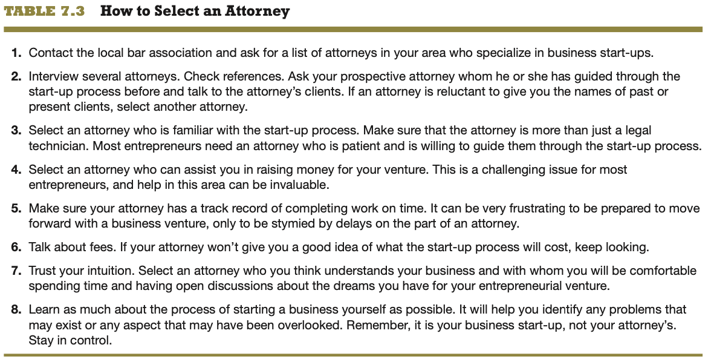
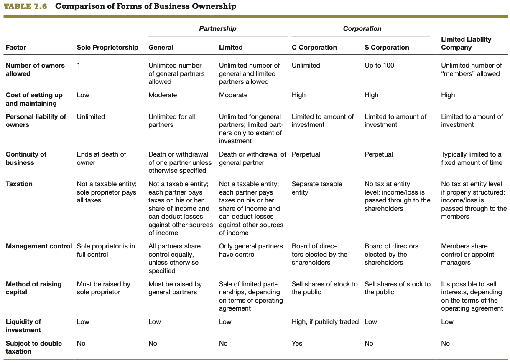

# ENT 2112 Homework 7

# Gus Lipkin

> All uncited quotes are from the textbook

1. When should your friend, who is considering launching a consulting firm to provide financial services to small businesses, think about the ethical climate she wants to establish in her venture?
   - Financial services are not the place to be if you want to skirt ethics. If she has to think about it at all, she shouldn't be giving financial advice.
2. Based on the information included in this chapter, in general, do entrepreneurs tend to overestimate or underestimate their knowledge of the laws that pertain to starting a new firm, and why?
   - They overestimate their knowledge because entrepreneurs are full of themselves and think they know everything. How else would they know that *their* idea is the "next big thing".
3. What are the prerequisites for building a strong ethical culture in a firm?
   - "*Pressure to compromise organizational standards.* This factor is an impor- tant warning sign of future workplace misconduct.
   - *Observed misconduct.* Misconduct is the most basic indicator of the state of integrity in an organization. To what extent do employees follow the rules and live out the core values of organization?
   - *Report observed misconduct.* This refers to whether employees report mis- conduct when they observe it, rather than remaining silent.
   - *Experience retaliation for reporting misconduct.* This refers to whether employees who report misconduct are retaliated against, such as by get- ting the silent treatment or being exposed to verbal harassment, demo- tions, undesirable assignments, or even violence.1"
4. What are some of the specific steps that can be taken in an entrepreneurial venture for the purpose of building a strong ethical culture?
   - Lead by example
   - Establish a code of conduct
   - Implement an ethics training program
   - Or, idk, don't hire people who have poor morals or ethics?
5. What is the purpose of a *code of conduct*?
   - "A **code of conduct** (or code of ethics) is a formal statement of an organization’s values regarding certain ethical and social issues.2 The advantage of having a code of conduct is that it provides specific guidance to entrepreneurs, manag- ers, and employees regarding expectations of them in terms of ethical behavior."
6. What is the purpose of establishing and using an *ethics training program* in an entrepreneurial firm?
   - "**Ethics training programs** teach business ethics to help employees deal with ethical dilemmas and improve their overall ethical conduct. An **ethical dilemma** is a situation that involves doing something that is beneficial to oneself or the orga- nization, but may be unethical."
7. What are some of the more important criteria to consider when selecting an attorney for a new firm?
   - 
8. What is a founders’ agreement and why is it important for a team of entrepreneurs to have one in place when launching a venture?
   - "If two or more people start a business, it is important that they have a found- ers’ (or shareholders’) agreement. A **founders’ agreement** is a written docu- ment that deals with issues such as the relative split of the equity among the firm’s founders, how individual founders will be compensated for the cash or the “sweat equity” they put into the firm, and how long the founders will have to remain with the firm for their shares to fully vest.6"
9. What is the purpose of a nondisclosure agreement and the purpose of a noncompete agreement?
   - "There are also two important written agreements that the majority of firms ask their employees to sign. A **nondisclosure agreement** binds an employee or another party (such as a supplier) to not disclose a company’s trade secrets. A **noncompete agreement** prevents an individual from competing against a former employer for a specific period of time."
10. How can entrepreneurial ventures avoid legal disputes?
    - Meet all contractual obligations
    - Avoid undercapitalization
    - Get everything in writing
    - Set standards
11. What is mediation and how do entrepreneurs use it to resolve disputes?
    - **Mediation** is a process in which an impartial third party (usually a professional mediator) helps those involved in a dispute reach an agreement.
12. At what point, during the process of starting a firm, does a business need to focus on the business licenses and permits that it needs, and why at that point?
    - When they're in the planning stage. If they do 90% of the work then find out they need a permit they won't be able to get, then that really sucks for them.
13. Why is it important for a firm’s founders to think carefully about the name they pick for their company?
    - "A **fictitious business name permit** allows a business to legally operate under a fictitious name, like Gold Coast Sea Food or Red Rock Bakery. Selecting a name for a business and obtaining a fictitious business name permit if needed is an important task, not only to comply with the law but because a business’s name is a critical part of its identity and its branding strategy. It is also one of the first things that people associate with a business."
14. Why isn’t choosing a legal entity a one-time event?
    - "As a business grows and matures, it is necessary to periodically review whether the current form of business organization remains appropriate."
15. What might trigger a firm’s decision to change how it is legally organized?
    - "As a business grows and matures, it is necessary to periodically review whether the current form of business organization remains appropriate."
16. What are the advantages and disadvantages of organizing a new firm as a sole proprietorship?
    - 
17. Is a sole proprietorship a separate legal entity? Why or why not?What are the differences between a general partnership and a limited partnership?
    - "A sole proprietorship is not a separate legal entity. For tax purposes, the profit or loss of the business flows through to the owner’s personal tax return document and the business ends at the owner’s death or loss of interest in the business."
      
18. What are the differences between a general partnership and a limited partnership?
    - 
19. What are the major advantages and disadvantages of a C corporation?
    - 
20. How is a C corporation subject to double taxation?
    - "A disadvantage of corporations is that they are subject to **double taxation**, which means that a corporation is taxed on its net income and, when the same income is distributed to shareholders in the form of dividends, is taxed again on shareholders’ personal income tax returns."

