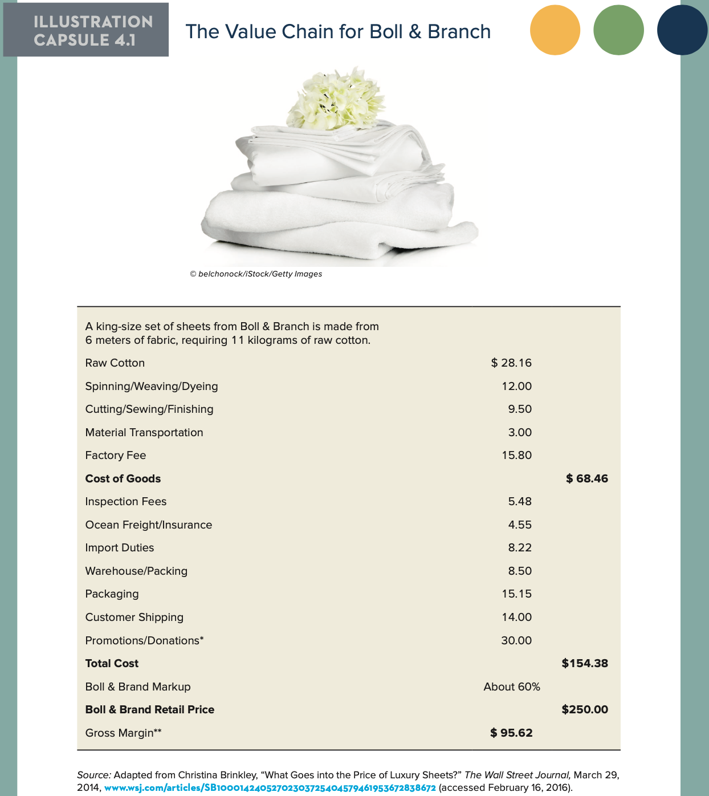
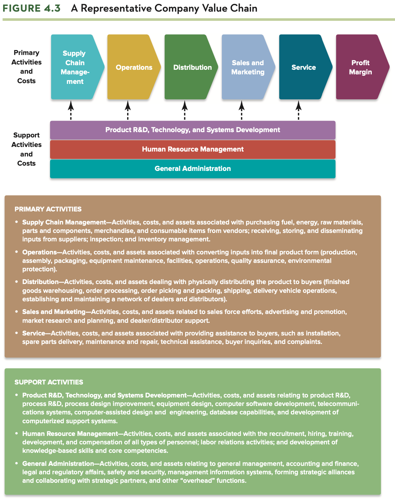

# MAN 4633 Homework 4

# Gus Lipkin

3. Review the information in Illustration Capsule 4.1 concerning Boll & Branch’s average costs of producing and selling a king-size sheet set, and compare this with the representative value chain depicted in Figure 4.3. Then answer the following questions:

   ## Illustration Capsule 4.1

   

   ## Figure 4.3

   

   1. Which of the company’s costs correspond to the primary value chain activities depicted in Figure 4.3?
      - All costs of goods, factory fees, material transportation, and other shipping costs.
   2. Which of the company’s costs correspond to the support activities described in Figure 4.3?
      - Inspection and import fees, promotions, and insurance.
   3. What value chain activities might be important in securing or maintaining Boll & Branch’s competitive advantage? Explain your answer.
      - The most important parts of Boll & Branch's operations to maintain their competitive advantage is their market research/R&D and their supply chain. They must produce products that people want and make it easy for consumers to buy those products.