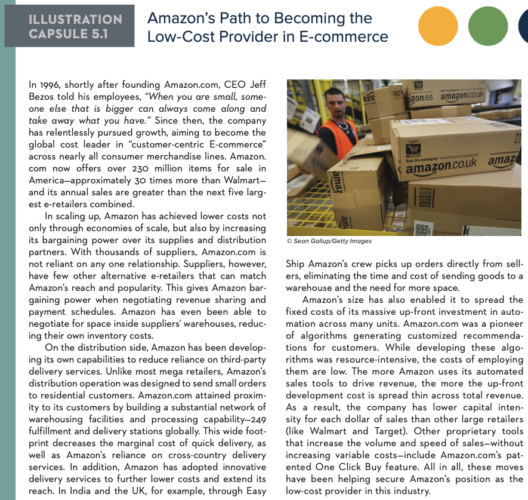

# MAN 4633 Homework 5

## Gus Lipkin

1. Best Buy is the largest consumer electronics retailer in the United States, with 2015 sales of over $50 billion. The company competes aggressively on price with such rivals as Costco, Sam’s Club, Walmart, and Target, but it is also known by consumers for its first-rate customer service. Best Buy customers have commented that the retailer’s sales staff is exceptionally knowledgeable about the company’s products and can direct them to the exact location of difficult-to-find items. Best Buy customers also appreciate that demonstration models of PC monitors, digital media players, and other electronics are fully powered and ready for in-store use. Best Buy’s Geek Squad tech support and installation services are additional customer service features that are valued by many customers.

   How would you characterize Best Buy’s competitive strategy? Should it be classified as a low-cost provider strategy? A differentiation strategy? A best-cost strategy? Explain your answer.

   - Best Buy's competitive strategy is a *broad differentiation strategy*. While consumers can buy electronics at other stores like Costco or Sam's Club or Target, few of them offer the services that Best Buy does. Outside of display TVs and a sparse selection of display units for assorted electronics, no chain store offers the in-store testing experience that Best Buy does. In addition, Best Buy offers in-store and at-home tech support through Geek Squad which no other company competes with. By setting themselves apart through expanded services, Best Buy employes a competitive strategy through differentiation.

2. Illustration Capsule 5.1 discusses Amazon’s low-cost position in the electronic commerce industry. Based on information provided in the capsule, explain how Amazon has built its low-cost advantage in the industry and why a low-cost pro- vider strategy is well suited to the industry.
   

   - Through economies of scale and high-entry cost/low maintenance cost technologies, Amazon has been able to maintain a low-cost advantage in the industry. By working in economies of scale, Amazon reduces it's costs. Rather than spreading themselves too thin with lots of warehouses and not a lot of product, they have a lot of product and a large network of warehouses and distribution centers. Amazon has also automated as much of the business as they can in order to reduce labor costs.

3. USAA is a Fortune 500 insurance and financial services company with 2014 annual sales exceeding $24 billion. The company was founded in 1922 by 25 Army officers who decided to insure each other’s vehicles and continues to limit its membership to active-duty and retired military members, officer candidates, and adult children and spouses of military-affiliated USAA members. The company has received countless awards, including being listed among *Fortune*’s World’s Most Admired Companies in 2014 and 2015 and 100 Best Companies to Work For in 2010 through 2015. USAA was also ranked as the number-one Bank, Credit Card, and Insurance Company by Forrester Research from 2013 to 2015. You can read more about the company’s history and strategy at **www.usaa.com**.

   How would you characterize USAA’s competitive strategy? Should it be classified as a low-cost provider strategy? A differentiation strategy? A best-cost strategy? Also, has the company chosen to focus on a narrow piece of the market, or does it appear to pursue a broad market approach? Explain your answer.

   - Without more information, it is difficult to tell if USAA is using a *focused low-cost strategy* or a *focused differentiation strategy*. Their strategy is definitely focused bceause they cater only to military service members and their associates. If they offer lower prices to their competitors then they would be a be using a low-cost strategy. If they offer similar prices to other companies, then they are simply trying to using a focused differentiation strategy. Although I'm not sure how in this case focused and differentiation would be separate things.

4. Explore lululemon athletica’s website at [**info.lululemon.com**](https://www.info.lululemon.com) and see if you can identify at least three ways in which the company seeks to differentiate itself from
   rival athletic apparel firms. Is there reason to believe that lululemon’s differentiation strategy has been successful in producing a competitive advantage? Why or why not?

   1. Lululemon transforms their stores into a yoga studio with free classes once a week.
   2. Lululemon offers wholesale and studio sales programs so that local business can benefit from the Lululemon brand.
   3. Lululemon offers complimentary hemming and light tailoring for any and all purchases made at a Lululemon store or online so that your clothes always fit as best they can.

   - If the stock market is to be believed, then Lululemon has done quite well for themselves with their *focused differentiation strategy*. Their stock value has steadily risen since their IPO in 2007. In addition, they have a loyal following among young adults even though their products are quite expensive. On the employee side of things (consumers judge companies on how they treat their employees), Lululemon is also doing quite well for themselves. They had a very good pandemic response that allowed employees to stay home and get paid when they needed to. 