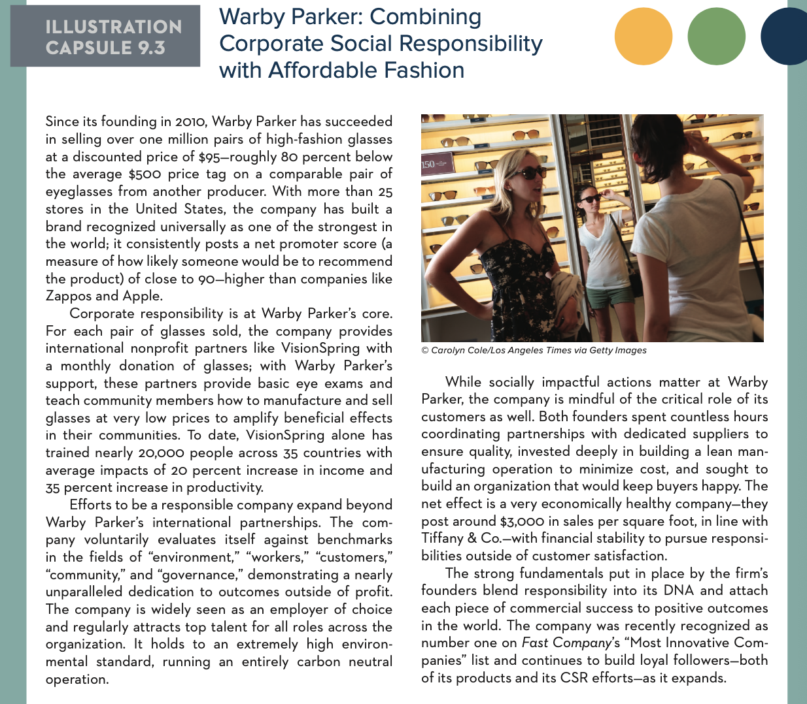

# MAN 4633 Homework 9

# Gus Lipkin

## Chapter 9

> 1. Widely known as an ethical company, Dell recently committed itself to becoming a more environmentally sustainable business. After reviewing the About Dell sec- tion of its website (**[www.dell.com/learn/us/en/uscorp1/about-dell](www.dell.com/learn/us/en/uscorp1/about-dell)**), prepare a list of 10 specific policies and programs that help the company achieve its vision of driving social and environmental change while still remaining innovative and profitable.

   1. By 2030, 50% of our global workforce and 40% of our global people leaders will be women
   2. With our technology and scale, we will advance health, education and economic opportunity initiatives to deliver enduring results for 1 billion people by 2030
   3. By 2030, we will fully automate our data control processes, making it easy for our customers to control their personal data
   4. We will reduce Scopes 1 and 2 greenhouse gas emissions by 50% by 2030
   5. We will source 75% of electricity from renewable sources across all Dell facilities by 2030 — and 100% by 2040
   6. Using renewables is essential in the fight against climate change. We’re 100% in support of 100% renewable power generation.
   7. We will reduce the energy intensity of our entire product portfolio by 80% (FY12-FY21)
   8. We will partner with our direct material suppliers to meet a science-based greenhouse gas emissions reduction target of 60% per unit revenue by 2030
   9. Our carbon footprint includes emissions our suppliers create as they provide products or services to us. So we support them as they work toward more renewables, greater energy efficiency, and better measurement and reporting.
   10. We will drive sustainability improvements in our global workplaces through 2030
> 2. Prepare a one- to two-page analysis of a recent ethics scandal using your university library’s access to LexisNexis or other Internet resources. Your report should (1) discuss the conditions that gave rise to unethical business strategies and behavior and (2) provide an overview of the costs resulting from the company’s business ethics failure.

   - In late 2018 and early 2019, two Boeing 737 MAX planes had abrupt mass casualty events. People were quick to try and draw conclusions about why these planes were crashing and tried to switch their flights to other models of plane. Eventually, the investigations turned to the 737 MAX's flight control software which was used to prevent engine stalls. It eventually came to light that the software was rushed out, production was not monitored, and that tests were not adequately administered. In addition, pilots were not made aware of the new software or how to disable it with manual override. Subsequently, the planes were grounded for several years while investigations were done, corrections were made, and the planes were approved again by the FAA.
     When the new 737 MAX planes were launched, they were so similar to past generations of 737 that pilots were only tasked with training on a tablet-based course like Canvas or Google Classroom, instead of a fully-equipped simulator like they would be if they were coming to a new plane. Similarly to the pilots, because the plane was so similar, Boeing did not have to get the plane fully re-certified. On October 29, 2018 Lion Air 610 crashed into the Java Sea and killed everyone on board. On March 10, 2019 Ethiopian Airlines 302 crashed and killed everyone onboard.
     Ultimately, the failures and groundings cost several hundred people their lives. Any airlines that flew the plane lost money from having it grounded and re-tooled. Boeing lost a lot of public trust and a lot of money when all is said and done.
> 3. Based on information provided in Illustration Capsule 9.3, explain how Warby Parker’s CSR strategy has contributed to its success in the marketplace. How are the company’s various stakeholder groups affected by its commitment to social responsibility? How would you evaluate its triple-bottom-line performance?
>
> 
- Warby Parker makes sure that it is only buying from responsible producers and donates to nonprofits to help other people see. In addition, they let potential customers try on glasses at home before buying so that they can reduce waste from people buying glasses then deciding they don't like it. I think it's triple-bottom-line performance is great.

4. Go to **[www.google.com/green/](www.google.com/green/)** and read about the company’s latest initiatives surrounding sustainability. What are Google’s key policies and actions that help it reduce its environmental footprint? How does the company integrate the idea of creating a “better web that’s better for the environment” with its strategies for creating profit and value. How do these initiatives help build competitive advantage for Google?
   - Google's key environmental policy is to be carbon free by 2030. It is planning on doing this by heavily investing in reneweable energy and resources. 

## LMVH Case Study

> Please read LVMH in 2016: ITs Diversification into Luxury Goods. Please read this case and submit your one-page analysis via Canvas by 3/7/21.  

> All uncited quotes are from the textbook

This analysis of LVMH will be done in the SWOT format.

### **Strengths**

- LVMH is a very well established brand
- In 2016 they had sales of €35.7 billion
- They merged with several other large competitors
- Their own stores

### **Weaknesses**

- Expensive products
- Bloated brands

### Opportunities

- Lower-cost products

### Threats

- Other high fashion brands

I think that LVMH is a powerhouse within the high-fashion industry and in the case study did not do anything wrong. The study presents LVMH as an unstoppable force in the industry.